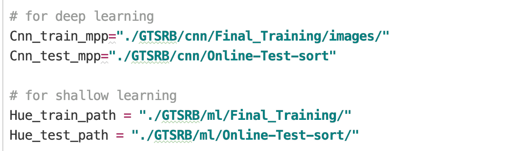
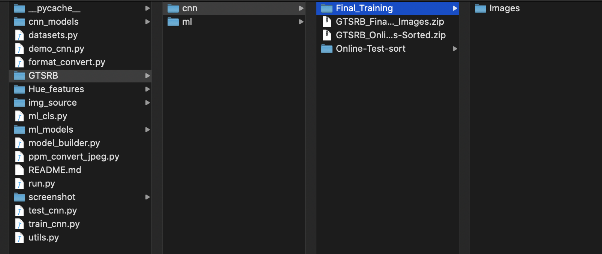

## MiniProject - Traffic sign recognition

##### Group: Tao Jiang Jiang(20004769)& Qiuying Li(19042765)


### dataset link
> Download the datasets form
> [GTSRB](https://sid.erda.dk/public/archives/daaeac0d7ce1152aea9b61d9f1e19370/published-archive.html).


#### Deep learning
>   training :  GTSRB_Final_Training_Images.zip

>   testing :   GTSRB_Online-Test-Images-Sorted.zip


#### Shallow learning 
>   training : GTSRB_Training_Features_HueHist.zip

>   testing : GTSRB_Online-Test-HueHist-Sorted.zip

#### Config dataset
> Unzip the datasets at `./GTSRB`, and then remove the dataset follow by `./run.py` just like below.




	
### Demonstration
> application demo
```bash
python run.py --operation demo
```


### Data proecessing
> convert the trainset of CNN ppm image to  jpeg.

```bash
python run.py --operation train_cnn_convert
```

> convert the testset of CNN ppm image to  jpeg.

```bash
python run.py --operation test_cnn_convert
```

> convert the testset and trainset of ML HueHist to Hue_features.

```bash
python run.py --operation hue_convert
```

### CNN model
> train the MobileNet model

```bash
python run.py --operation train_cnn
```

> test the MobileNet model

```bash
python run.py --operation test_cnn
```

### Shallow learning model 
> test Random Forest model

```bash
python run.py --operation test_rf
```

> test AdaBoost model

```bash
python run.py --operation test_ab
```

>If need retrain shallow learning models, please delete the model at 'ml_models'.
